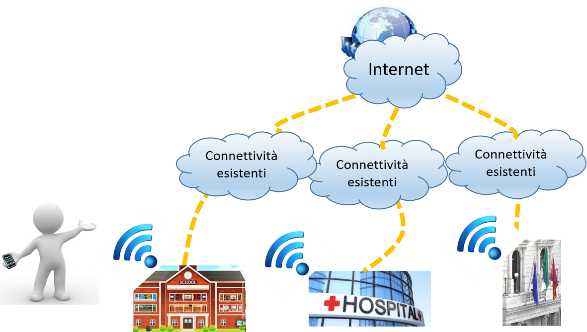

Premessa
========

Negli ultimi anni si è assistito ad un processo evolutivo nell'ambito
delle tecnologie di comunicazione in mobilità e/o senza fili che ha
enormemente incrementato la diffusione di servizi sempre più sofisticati
che hanno contribuito ad alimentare la necessità di connettività
internet sempre disponibile. Tutto ciò è stato in larga parte favorito
dalla disponibilità di dispositivi multicanale e dotati di adeguate
risorse hardware nonché di piattaforme middleware modulari. La
diffusione quindi di servizi e applicazioni ha concorso e concorre alla
‘Crescita Digitale' del Paese in questa era tecnologica "sempre"
connessa, nella quale persone e cose sono in grado di comunicare e
scambiare informazioni in tempo reale. La necessità di connessione
permanente richiede evidentemente la disponibilità di accesso ad
internet senza soluzione di continuità, pertanto il servizio di accesso
ad Internet in mobilità, o wireless, viene a divenire esso stesso un
servizio richiesto dagli utenti in particolare nei settori turistici,
sanitari e della formazione. La Pubblica Amministrazione di conseguenza,
in qualità di "facilitatore" all'accesso a questi servizi è chiamata a
fornire nuovi servizi digitali, in modalità gratuita per gli utenti, e
utilizzando le tecnologie Wi-Fi per la loro fruizione.

