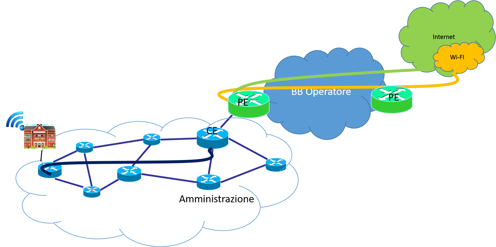

Criteri di implementazione del servizio per le PA
=================================================

Organizzazione e ruoli del Servizio
-----------------------------------

Nel *framework* organizzativo del servizio WI-FI possiamo individuare 3
ruoli:

-  Service Provider: l'organizzazione o Ente che coordina e gestisce il
   servizio;

-  Resource Provider: operatori che gestiscono l'infrastruttura di rete
   e la connettività internet e che permettono agli utenti di accedere a
   internet;

-  User: l'utente finale del servizio.

Andiamo ad analizzare in dettaglio i suddetti ruoli

Il Service Provider 
~~~~~~~~~~~~~~~~~~~~

Il Service Provider è il fornitore (organizzativo) del Servizio ed è
rappresentato dall'Ente responsabile della progettazione, della gestione
e delle evoluzioni del servizio stesso. Il Service Provider gestisce le
policy di accesso per la connessione al servizio e per la generazione
delle credenziali, necessarie agli utenti, per poter accedere alla rete.
Nel presente documento il Service Provider è rappresentato
dall'Amministrazione che eroga il servizio.

Resource provider
~~~~~~~~~~~~~~~~~

Il Resource Provider fornisce l'infrastruttura di rete e la connettività
per l'utente che sia stato identificato secondo le modalità stabilite.

Il Resource Provider coincide con l'operatore che fornisce, attraverso
la propria infrastruttura, l'accesso a Internet.

User
~~~~

È l'utente finale del servizio, cittadino e/o turista, che accede al
servizio WI-FI per l'accesso ai servizi digitali.

Architettura del servizio per le Reti della PA
-------------------------------------------------

Questo paragrafo intende fornire una panoramica delle possibili
architetture per le Pubbliche Amministrazioni che debbano erogare il
servizio WI-FI, senza entrare in dettagli tecnologici specifici. Ciò che
si propone questo paragrafo è fornire indicazioni in merito ai requisiti
funzionali necessari a realizzare il servizio, che possano essere
implementati nei diversi modelli di gestione IT dagli Enti interessati.

Da quanto riportato nei paragrafi precedenti, si sottolinea
l'obbligatorietà di identificazione in modalità diretta o indiretta
dell'utente, da parte di almeno uno dei provider infrastrutturali, al
fine di poter rispondere ai dettami normativi in materia di
tracciabilità dell'utente.

Identificazione
~~~~~~~~~~~~~~~~

Oggi esistono molteplici installazioni del servizio Wi-Fi ad opera di
enti della PA centrale e locale.

Nelle suddette implementazioni troviamo specifiche modalità di
registrazione e autenticazione come ad esempio il *"captive
portal"* [16]_, passando da soluzioni semplici, come la ricezione
delle credenziali via SMS, a più elaborate, prevedendo la compilazione
di moduli on-line.

Per quanto riguarda l'identificazione dei turisti, visti gli oneri di
identificazione posti in capo agli albergatori, si ritiene opportuno
investigare in merito alla possibilità di interoperare con le strutture
alberghiere al fine di poter assegnare credenziali per l'utilizzo della
Wi-Fi gratuita per il periodo di permanenza in Italia.

Da quanto espresso nel presente documento, si ribadisce comunque la
necessità di identificazione dell'utente, attraverso meccanismi diretti
o indiretti, che consentano agli operatori di ottemperare alle
prestazioni obbligatorie nei confronti dell'autorità giudiziaria.

L'architettura del servizio prevede che l'utente finale ovvero il
cittadino, o il turista, si colleghi all'hotspot del servizio Wi-Fi
pubblico dell'Amministrazione, e venga autorizzato all'accesso.

Le credenziali generate all'atto dell'iscrizione al servizio vengono
riutilizzate in tutte le connessioni successive dell'utente
finale [17]_.

.. figure:: media/architettura-rete-pa.png
   :alt: Architettura rete PA
   :name: architettura rete pa

Configurazione della rete interna
~~~~~~~~~~~~~~~~~~~~~~~~~~~~~~~~~

Le Amministrazioni devono garantire l'accesso WI-FI gratuito agli utenti
attraverso Access Point o Hot Spot installati presso le proprie sedi
fornendo connettività internet.

Al fine di realizzare tale servizio si rende necessario che sulle reti
delle Amministrazioni siano configurate regole di segregazione del
traffico e sicurezza.

In particolare le Amministrazioni dovranno realizzare, sulla propria
rete interna, un'infrastruttura dedicata al servizio Wi-Fi, secondo una
delle seguenti modalità:

-  rete fisica separata e dedicata al servizio;

-  una rete virtuale di livello 2 della pila ISO/OSI;

-  rete virtuale di livello 3 della pila ISO/OSI (MPLS).

Le ultime due opzioni prevedono la configurazione di Virtual LAN (VLAN),
per poter segregare il traffico, che con opportune politiche di routing,
verrà trasportato alla prima uscita disponibile su Internet.

La rete interna deve consentire la configurazione descritta avendo le
seguenti caratteristiche minime:

-  Cablaggio di categoria minima UTP CAT-4 (è necessaria la categoria 5E
   o 6 per il supporto dello standard 802.11ac Wave2);

-  Apparati di tipo ethernet switched;

-  Subnet di indirizzi IP, dedicata al servizio.

Sarà necessario, inoltre, implementare i seguenti protocolli e servizi:

-  DHCP (Dynamic Host Configuration Protocol), protocollo usato per
   assegnare gli indirizzi IP agli utenti;

-  DNS (Domain Name Service), servizio di directory, utilizzato per la
   risoluzione di nomi di Host in indirizzi IP;

-  Smart Switch per il supporto di più istanze del protocollo Spanning
   Tree, di LAN virtuali (VLANs) secondo lo standard 802.1Q, mirroring
   delle porte

-  supporto della QoS (Quality of Service).

Sulla rete dedicata al servizio, fisica o virtuale, saranno attestati
gli Access Point dell' area, i firewall dedicati e il collegamento
(logico o fisico) verso il router di frontiera della sede.

Rete Geografica
~~~~~~~~~~~~~~~

In generale, il traffico Wi-Fi trasportato dagli access point delle sedi
remote, attraverso la suddetta rete interna dedicata, avrà un accesso
Internet attraverso il router di frontiera dell'Amministrazione.

Nel caso l'Amministrazione abbia una sola sede, il router di frontiera
consegnerà il traffico alla rete dell'operatore, che a sua volta lo
trasporterà con le opportune classificazioni.

Per le Amministrazioni con più sedi, collegate con una intranet
geografica, il traffico locale è trasportato fino al router di
frontiera, attraversando tutta l'infrastruttura geografica (intranet) e
consegnato all'operatore dal router di frontiera.

Il collegamento geografico tra il router di frontiera
dell'Amministrazione, il router dell'operatore e il canale dedicato al
traffico del servizio Wi-Fi, può essere realizzato attraverso più
modalità:

-  Link comune con classificazione del traffico Wi-Fi Less Than Best
   Effort per non sovraccaricare o deteriorare il traffico di normale
   funzionamento dell'amministrazione in linea con l'art.8 bis del CAD;

-  Link fisico dedicato al servizio con uscita su Internet;

-  Link virtuale (es. MPLS) dedicato al servizio.

In ciascuno dei suddetti casi devono essere previste opportune misure di
sicurezza che insistono sul traffico Wi-Fi, meglio se collocate prima
della consegna del traffico all'operatore.

Misure minime di sicurezza
~~~~~~~~~~~~~~~~~~~~~~~~~~

L'Amministrazione deve garantire opportune misure di sicurezza per la
gestione del traffico Wi-Fi. Si elencano di seguito le funzionalità
minime richieste:

-  Firewalling, per il controllo e la protezione a livello perimetrale
   della rete;

-  Antivirus, per la protezione a livello centrale, per evitare
   compromissioni da malware provenienti dai dispositivi mobili;

-  Data Loss Prevention, per la protezione dei dati e per evitare
   perdite di informazioni aziendali;

-  Policy di web-filtering, per l'utilizzo dei soli protocolli
   sicuri [18]_, per l'accesso al servizio e la limitazione ai soli siti
   web e servizi consentiti.

Access Point - AP
~~~~~~~~~~~~~~~~~

Al fine di garantire un segnale wireless stabile, è fondamentale
progettare il posizionamento degli AP, in modo tale che non si
verifichino interferenze e si massimizzi la copertura, e parallelamente,
minimizzare le sovrapposizioni. Gli AP gestiti sono controllati e
configurati centralmente, da un apparato controller, in grado di
ottimizzare la rete come mostrato di seguito a titolo esemplificativo,
mediante:

-  Gestione dell'utilizzo degli Access Point;

-  Separazione corretta dellla rete di accesso dalla rete di trasporto;

-  Collegamento di tutti gli access point alla LAN (rete di trasporto)
   esclusivamente in modalità cablata.

Gli AP devono garantire funzionalità di gestione dei client, del routing
e della banda disponibile, al fine di instradare correttamente il
traffico WI-FI, e in generale devono avere le seguenti caratteristiche:

-  essere conformi agli standard IEEE 802.11a, 802.11b, 802.11g,
   802.11n. Quest'ultimo standard deve essere supportato sia nella banda
   2.4 GHz che 5 GHz.

-  essere alimentabili anche in modalità Power-overEthernet (PoE) in
   accordo allo standard IEEE 802.3af, senza perdita significativa di
   prestazioni.

-  devono supportare il meccanismo del "VLAN tagging" secondo lo
   standard 802.1q e devono poter essere gestiti su di una "tagged
   VLAN".

-  essere aggiornati automaticamente col software appropriato via rete e
   senza necessità di interventi in campo, a partire dal Centro di
   Controllo.

-  essere di tipo Dual Radio (Band Unlocked) / Dual Band, in grado di
   offrire accesso ai client sia nella banda 2,4 GHz che 5 GHz, oppure
   di offrire in banda 5 GHz connettività di tipo Mesh per connettere
   gli Access Point non cablati (detti Mesh Access Point o MAP) agli
   Access Point cablati alla rete wired (detti Root Access Point o RAP).

-  devono supportare canali da 20MHz e 40MHz.

-  devono supportare almeno 8 SSID (Service Set Identifiers); per ogni
   SSID dovrà essere possibile definire delle policy specifiche per la
   sicurezza e l'autenticazione.

-  devono supportare anche il protocollo di autenticazione 802.1x su
   server Radius remoto

-  devono supportare la funzionalità di "client isolation".

Centro di controllo
~~~~~~~~~~~~~~~~~~~

Gli Access Point possono essere gestiti attraverso il centro di
controllo, che dovrà consentire, la configurazione e la gestione della
rete Wi-Fi, da un unico punto centralizzato interno o esterno
all'Amministrazione.

Sicurezza del Sistema
~~~~~~~~~~~~~~~~~~~~~

La sicurezza del sistema deve essere garantita attraverso l'applicazione
di policy che prevedano sia tecniche di web – filtering per poter
limitare l'accesso a siti consentiti che l'utilizzo di protocolli sicuri
per l'accesso ai servizi come HTTPS.

Ad ogni modo il responsabile del servizio Wi-Fi dovrà concordare con il
responsabile dei servizi di sicurezza, delle sessioni almeno annuali di
**vulnerability assessment** dell'intera infrastruttura.

Requisiti del servizio per le Amministrazioni collegate su SPC
--------------------------------------------------------------

L'accesso al servizio WI-FI verso i cittadini sarà reso disponibile
attraverso l'infrastruttura SPC di connettività della quale sono dotate
le Amministrazioni.

Le risorse di banda disponibili al servizio WI-FI, non devono in alcun
modo degradare il funzionamento dei processi digitali della Pubblica
Amministrazione.

Durante lo svolgimento del normale orario di lavoro di ciascun Ufficio e
sede di Ente pubblico coinvolto, il servizio dovrà usufruire della sola
capacità di banda Internet non utilizzata per i normali processi
aziendali e comunque, nell'orario di chiusura non dovrà interferire con
i servizi digitali erogati in regime di continuità ovvero H24.

La Banda non utilizzata, che potrebbe essere assegnata al servizio
Wi-Fi, potrà essere determinata attraverso una attività di monitoraggio
in *real-time,* da effettuarsi a cura dell'Amministrazione per il
tramite di opportuni strumenti per l'analisi della rete.

Il Capitolato di gara Consip, per la Connettività, ha definito Classi di
Servizio e Ambiti atti all' identificazione e separazione dei traffici
pregiati e diretti o verso Internet, Intranet e Infranet.

La figura di seguito riporta un'ipotesi di architettura con l'ambito
Wi-Fi aggiuntivo realizzato attraverso una nuova VRF [19]_ sugli
apparati degli operatori.

Per quanto riguarda l'implementazione del servizio sulla rete interna o
sulla rete geografica, l'Amministrazione deve erogare il servizio Wi-Fi,
realizzando una delle opzioni menzionate ai paragrafi precedenti.

Utilizzo di spazio di indirizzamento IPv6
-----------------------------------------

Nel caso l'Amministrazione volesse utilizzare uno spazio di
indirizzamento IPv6 da assegnare al servizio WI-FI, è consigliato
l'utilizzo dello spazio privato, al fine di evitare eventuali problemi
di DDoS tra utenti dello stesso hot spot.

Gli indirizzi privati o locali, analoghi a quelli IPv4, possono essere
usati solo all'interno di ogni rete (o Site) e non vengono instradati
all'esterno. Iniziano con i 9 bit: 1111 1110 1 (da FE8x::/9 a FEFx::/9)
e sono anche detti "unregistered" o "nonroutable". Sono divisi in due
categorie:

-  i Link-local Addresses, che vengono sempre bloccati dai Router, e
   sono quindi locali solo ad un segmento di rete (switched LAN) o ad
   una subnet. Vengono usati per la "automatic address configuration",
   per le funzioni ND-Neighbor Discovery (es. Router discovery) e per
   l'ARP. Hanno come decimo bit uno "0", per cui cominciano con FE8x,
   FE9x, FEAx e FEBx;

-  i Site-local Addresses, che possono essere instradati dai Router di
   una organizzazione solo all'interno della rete privata (Site), quindi
   tra le sue subnet, ma non verso Internet; iniziano con FECx, FEDx,
   FEEx ed FEFx, avendo come decimo bit un "1".

Sistema di monitoraggio centralizzato del funzionamento dei punti Wi-Fi
-----------------------------------------------------------------------

Ai fini del monitoraggio della rete Wi-Fi si suggerisce l'adozione da
parte delle PPAA di un sistema di monitoraggio centralizzato che renda
disponibili almeno le seguenti informazioni:

-  Banda utilizzata;

-  numero di apparati monitorati;

-  numero di apparati in allarme per anomalie;

-  informazioni sull' AP (situazione e posizione geografica);

-  statistiche di funzionamento degli AP.

Il sistema di monitoraggio fornirà uno strumento di visualizzazione
degli AP, dal quale sarà possibile l'immediata visualizzazione dello
stato di funzionamento degli stessi. Consentirà inoltre il collegamento
alle informazioni di dettaglio presenti all'interno del sistema stesso.

.. [15] http://www.consip.it/bandi-di-gara/gare-e-avvisi/gara-reti-locali-6

.. [16] Il "captive portal" è una pagina web, mostrata agli utenti di una rete di
   telecomunicazioni, per effettuare la connessione ad Internet.

.. [17] Al primo accesso l'utente si collega ai server (Radius o Network Access Server)
   che devono verificare l'identità, e associare le credenziali all'utente. La
   condizione vincolante all'autorizzazione all'accesso è che l'identità
   dell'utente sia verificabile: di fatti è possibile utilizzare modalità
   indirette come la registrazione al servizio attraverso la SIM del cellulare o
   numero di carta di credito (in particolare per gli stranieri) e/o il servizio
   SPID per gli utenti italiani. Il numero dei dispositivi associabili all'utenza
   dipende dai vincoli posti dal Service Provider.

.. [18] Transport Layer Security (TLS) è una tecnologia che la connessione ad una rete sia sicura

.. [19] È una tecnica di routing per la segregazione virtuale delle risorse di rete

